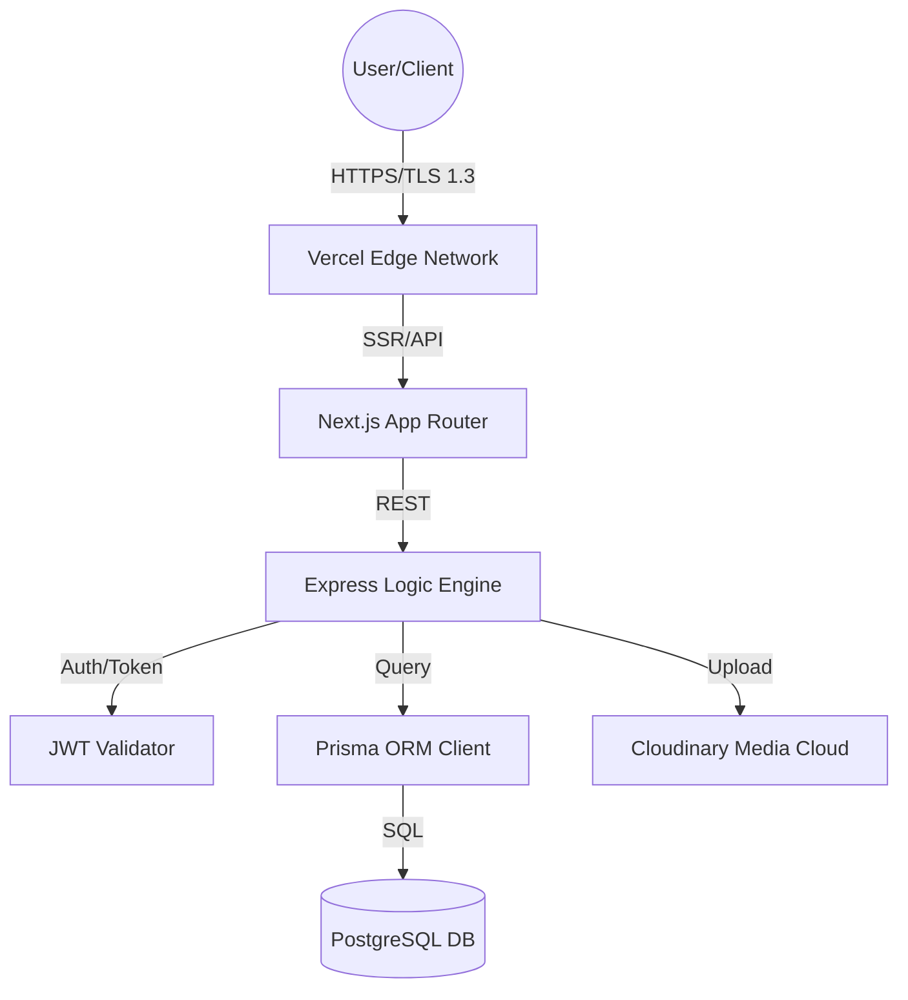

# 📘 PTS Platform Knowledge Base & Architecture Document
**Designed for**: Personal AI Research & Training (NotebookLM)  
**Project**: Phone/Police Theft Tracking System (PTS)  
**Organization**: Vexel Innovations  
**Version**: 3.0 (Comprehensive Build)  
**Status**: Active Production Archive

---

## 1. 🎯 Project Mission & Executive Overview
The **Phone Theft Tracking System (PTS)** is a decentralized digital trust infrastructure designed to eliminate the resale value of stolen mobile devices. By creating a verifiable, immutable "Chain of Custody" for every mobile device (identified by IMEI), PTS transforms a phone from a simple commodity into a secured asset with a traceable history.

### **Core Problem Solved**
Traditional theft prevention (Find My iPhone, Google Find My Device) focuses on *individual recovery*. PTS focuses on *ecosystem-wide rejection*. It makes a stolen phone radioactive in the marketplace by flagging its IMEI across a national registry accessible by:
- **Citizens** (Safe-purchasing check)
- **Vendors** (Inventory verification)
- **Law Enforcement** (Forensic tracking & recovery)
- **Technicians** (Component level "DNA" verification)

---

## 2. 🏗️ Platform Architectural Blueprint
PTS utilizes a decoupled, high-performance web architecture optimized for reliability and rapid search.

### **The Technology Stack**
- **Frontend**: **Next.js 15+ (React)**. Utilizes App Router, Server-Side Rendering (SSR) for real-time dashboards, and Incremental Static Regeneration (ISR) for public IMEI lookups.
- **Backend**: **Node.js (Express)**. A stateless RESTful API layer handling authentication, role-based logic, and database orchestration.
- **Database**: **PostgreSQL** via **Prisma ORM**. A relational ledger ensuring ACID compliance for every ownership transfer.
- **Media Engine**: **Cloudinary**. Handles secure, moderate, and forensic-ready image storage for device photos and incident reports.
- **Deployment**: **Vercel** for both Frontend and Backend, utilizing Edge Middleware for security headers and rate limiting.

### **Deployment Topology**

---

## 3. 🗄️ Core Entities & Data Model (The "Ledger")
The system's integrity is defined by its relational schema (`schema.prisma`).

### **Principal Models**
1.  **`User`**: The identity layer. Supports roles like `CONSUMER`, `VENDOR`, `POLICE`, `ADMIN`, `INSURANCE`, and `TELECOM`.
2.  **`Device`**: The primary asset. Tracks IMEI, brand, model, status (`CLEAN`, `STOLEN`, `VENDOR_HELD`), and `RiskScore`.
3.  **`Certificate`**: A digital NFT-like proof of ownership. Each device transfer issues a new active certificate and deactivates the old one.
4.  **`OwnershipTransfer`**: Records the "Handover" process between users. Includes an optional **Escrow** mechanism for P2P safety.
5.  **`IncidentReport`**: The forensic log for theft. Stores location data, descriptions, and police report numbers.
6.  **`TransactionHistory`**: The immutable "Black Box" of the system. Every status change, registration, or sale is logged here with an actor ID (User who performed it).
7.  **`MaintenanceRecord`**: Tracks repairs. Links a `Device` to a `Repair Vendor` and logs which parts were replaced (Component DNA).

---

## 4. 👥 Role-Based Access Control (RBAC)
PTS uses a strict hierarchy of permissions to ensure data sovereignty.

| Role | Access Level | Primary Capabilities |
| :--- | :--- | :--- |
| **GUEST** | Public | IMEI Check, Verify Certificate, Read Safety Guides. |
| **CONSUMER** | Private | View owned devices, Flag stolen, Initiate transfer, View recovery map. |
| **VENDOR** | Commercial | Register new stock, Process sales, Verify trade-ins, Submit suspicious device alerts. |
| **POLICE** | Sovereign | Global search, Suspect tracking, "Bricking" authorization, Witness statement review. |
| **ADMIN** | Executive | User management (Approve vendors), System configuration, Financial oversight. |

---

## 5. 🔄 Key Business Workflows

### **Workflow A: The "Safe-Purchase" Handshake**
1. A **Buyer** and **Seller** meet.
2. The Buyer scans the Seller's device QR code or enters the IMEI into the PTS public portal.
3. PTS returns the **Public Trust Index**:
    - **Green (0-20)**: Clean history, verifiable owner.
    - **Yellow (20-60)**: Missing data or recent transfers.
    - **Red (60-100)**: Marked **STOLEN** or **INVESTIGATING**.

### **Workflow B: Reporting Theft (The "Lockdown")**
1. **Consumer** logs in -> Selects device -> Clicks **"Report Stolen"**.
2. **System Action**:
    - Sets `Device.status = STOLEN`.
    - Updates `Device.riskScore = 100`.
    - Creates an `IncidentReport` entry.
    - Broadcasts to the **Guardian Mesh** (if enabled).
    - Logs the event in `TransactionHistory`.

### **Workflow C: Ownership Transfer (Secondary Market)**
1. **Seller** initiates a "Sale" in their dashboard.
2. System generates a **Handover Code** (6-digit 2FA).
3. **Buyer** enters the code in their PTS portal.
4. **Backend** deactivates the Seller's `Certificate` and issues a new one to the Buyer.
5. Chain of Title is updated.

---

## 6. 🛡️ Advanced "Echelon" Features
PTS is built on a modular roadmap known as "Evolutionary Echelons."

### **Echelon I: Foundation (The DNA)**
- **Component DNA**: Logging serial numbers of internal parts (Battery, Screen, Logic Board).
- **Integrity Checks**: Detecting if a "Stolen" screen is put into a "Clean" phone during a repair check.

### **Echelon II: Guardian Mesh (The Hunt)**
- **Decentralized Proximity**: Uses Bluetooth/WiFi signatures of lost devices to allow nearby "Guardian" users to report silent sightings to the Police and Owner without exposing the observer's identity.

### **Echelon III: The Sovereign Market (The Kill-Switch)**
- **P2P Escrow**: Funds are held in a secure lock until the digital transfer of the IMEI is confirmed by both parties.
- **Hardware Bricking**: A privileged API link with Telecoms and MDM providers to remotely disable the motherboard of a stolen device.

---

## 7. 🔌 API Reference & Endpoints
The backend is organized into specialized routers:

- **`/api/v1/auth`**: Login, Registration, OTP verification.
- **`/api/v1/public`**: Unauthenticated IMEI lookups.
- **`/api/v1/devices`**: Device registration and metadata updates.
- **`/api/v1/transfers`**: Handover logic and ownership handshake.
- **`/api/v1/incidents`**: Reporting theft and recovery.
- **`/api/v1/police`**: Advanced telemetry, suspect IDs, and forensic logs.
- **`/api/v1/vendors`**: Bulk registration, stock management, and trust score metrics.
- **`/api/v1/passports`**: Generates a PDF "Device Passport" for legal travel/sale.

---

## 8. 🛠️ Knowledge Base for Maintenance & Troubleshooting

### **Handling "Duplicate IMEIs"**
- **Symptom**: A vendor tries to register an IMEI already in the system.
- **Solution**: The system triggers a "Cloned Device Investigation." The new vendor must upload the physical carton photo for manual Admin verification.

### **Escrow Disputes**
- **Protocol**: If a buyer claims a device is faulty during an escrow transfer, the status moves to `DISPUTED`. An Admin reviews the `ProofOfSale` and logs before releasing funds or issuing a refund.

### **Database Performance**
- **Indexing**: Frequent queries are performed on `IMEI`, `Email`, and `qrHash`. These are indexed in PostgreSQL to ensure <10ms response times even with millions of records.

---

## 9. 🚀 Future Roadmap (2025-2027)
1. **Inter-National Sync**: Connecting with Interpol and GSMA global registries.
2. **AI Suspect Matching**: Using theft patterns to predict high-risk "Chop Shop" locations.
3. **WhatsApp/Telegram Oracle**: Allowing citizens to verify phones via chat bots.
4. **Physical Tagging**: Integration with NFC/RFID physical tags for high-end devices.

---
**Document Status**: COMPREHENSIVE  
**Confidentiality**: Project Internal (For LLM Training Context)  
**Maintained by**: Vexel Innovations Engineering Team
