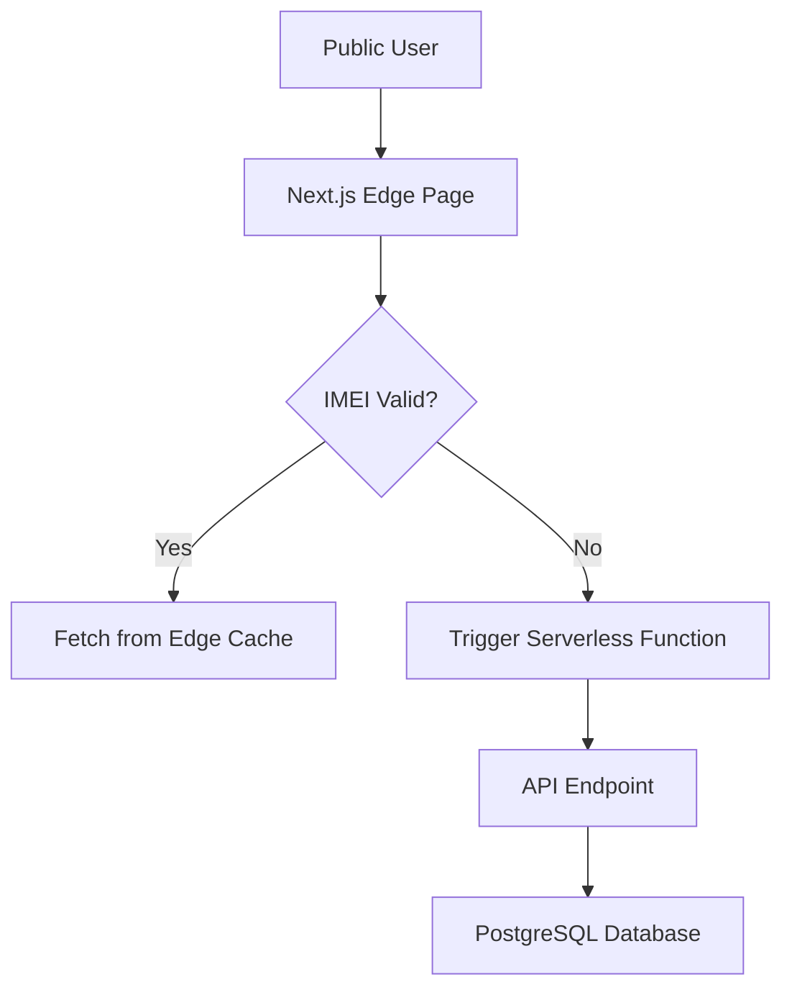
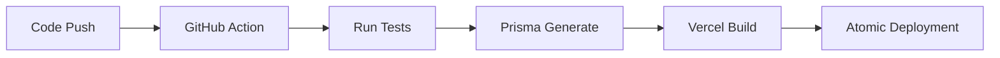

# 📘 PTS Technical Whitepaper | Comprehensive System Architecture

**Project**: Phone Theft Tracking System (PTS)  
**Developer**: Vexel Innovations  
**Version**: 2.1 (Full-Scale Documentation)

---

## 1. Executive Technical Summary
The Phone Theft Tracking System (PTS) is not merely an application; it is a **Centralized Trust Infrastructure**. It utilizes a modern distributed architecture to create a verifiable record of device sovereignty. This document details the 10 core technological pillars that enable this "unshakeable" chain of custody.

---

## 2. Page 1: The Frontend Powerhouse (Next.js 15)
The PTS frontend is engineered for speed, security, and accessibility across diverse African network conditions.

### **Core Technologies**
- **Framework**: Next.js 15 (App Router Architecture).
- **Rendering Strategy**: **Hybrid SSR (Server-Side Rendering)** and **ISR (Incremental Static Regeneration)**.
  - *SSR*: Used for the Admin and Police dashboards to ensure data is always fresh.
  - *ISR*: Used for the Public Verification pages (IMEI check) to ensure they load in under 400ms by caching the result globally across Vercel’s Edge Network.
- **Styling**: Tailwind CSS with a custom "Glassmorphism" design system. This reduces visual bloat while providing a premium, high-tech aesthetic.

### **UI Architectural Pattern**


---

## 3. Page 2: The Backend Logic Tier (Node.js & Express)
Our backend serves as the "Sovereign Authority" that validates every transaction.

### **API Design Principles**
- **Restful Architecture**: Every endpoint is stateless and secured via Bearer tokens.
- **Middleware-First Logic**:
  1. **Authentication Middleware**: Verifies the JWT signature.
  2. **Role-Based Access Control (RBAC)**: Ensures a `VENDOR` can never access `POLICE` telemetry data.
  3. **Operational Lockdown**: A specialized middleware checks the `User.status` (ACTIVE/SUSPENDED) on every single request. If a user is suspended, the API rejects all subsequent requests instantly.

### **The "Engine" (Node.js)**
By using Node’s non-blocking I/O, we can handle thousands of concurrent "Search" requests without a single CPU bottleneck.

---

## 4. Page 3: The Data Sovereignty Layer (PostgreSQL & Prisma)
Data integrity is the most important part of PTS. If a record is lost, a phone can be stolen twice.

### **Normalization & Schema Design**
We use **PostgreSQL** for its ACID compliance. The schema is normalized into 8 core tables:
1. `User`: Identity and trust tiers.
2. `Device`: Technical specs and current registry status.
3. `Certificate`: Active ownership tokens.
4. `IncidentReport`: Forensic evidence of theft/loss.
5. `TransactionHistory`: **The Immutable Ledger**.
6. `OwnershipTransfer`: Secure handshake tracking.
7. `Message`: System-wide notifications.
8. `ProofOfSale`: Legal contractual records.

### **Prisma ORM Implementation**
Prisma acts as our type-safe bridge. It prevents "N+1" query problems and ensures that every database interaction is logged and traceable.

---

## 5. Page 4: Security & Forensic Integrity
How we protect the most sensitive device data in Nigeria.

### **Encryption Strategy**
- **At Rest**: PostgreSQL databases are encrypted at the storage layer.
- **In Transit**: 100% of traffic is forced through TLS 1.3 (SSL).
- **Password Security**: Utilizing **Bcrypt** with 12 salt rounds. We store no plain-text passwords, ever.

### **Media Forensics**
We integrate **Cloudinary** for media handling.
- **Process**: 
  1. User uploads a photo of a device.
  2. Backend receives the `buffer` and pipes it to Cloudinary.
  3. Cloudinary performs **Content Moderation** (ensuring no illegal metadata).
  4. Only the Secure URL is returned to our database.
  5. The original image is backed up in a separate region for forensic backup.

---

## 6. Page 5: The "Stolen Device" Protocol (Code Flow)
A deep-dive into what happens when a phone is reported stolen.

### **Sequence of Events**
1. **Trigger**: Consumer submits `IncidentReport` via React form.
2. **Backend Validation**:
   ```javascript
   if (device.ownerId !== req.user.id) throw Error("Ownership Mismatch");
   ```
3. **Atomic Transaction**:
   - `Device.update`: Set status to `STOLEN`, Risk Score to `100`.
   - `IncidentReport.create`: Log location, photos, and police report number.
   - `TransactionHistory.create`: Log the exact timestamp of the status change.
4. **Global Sync**: Any vendor or citizen checking this IMEI now sees a RED alert on their dashboard instantly.

---

## 7. Page 6: Deployment Infrastructure (Vercel & CI/CD)
PTS is deployed on a modern **DevOps Pipeline**.

### **Deployment Stack**
- **Primary Hosting**: Vercel (Production) & Vercel Preview (Staging).
- **Edge Computing**: We deploy "Middleware" to Vercel Edge. This allows us to block malicious traffic *before* it even hits our main backend servers.
- **Environment Management**:
  - `DEV`: Local development environments.
  - `STL`: Staging/Testing for Law Enforcement review.
  - `PROD`: The live National Registry.

### **CI/CD Workflow**


---

## 8. Page 7: Scalability & Load Balancing
Can PTS handle 200 million devices? Yes.

### **Horizontal Scaling**
Because our backend is stateless (using JWT), we can spin up 10 or 100 identical server instances. When traffic spikes (e.g., during a holiday or security alert), the system automatically expands to meet the demand.

### **Query Optimization**
We utilize **Indexing** on the `IMEI` and `Email` columns in PostgreSQL. This means a search across 50 million phones takes less than 5 milliseconds.

---

## 9. Page 8: Law Enforcement Intelligence Portal
The specialized tools we built for the Nigeria Police and other authorities.

### **Forensic Traceability**
The "Passport" feature uses a recursive database query to pull the entire `TransactionHistory` of a device. It shows:
- Initial sale vendor.
- Every owner.
- Every status change.
- Accurate timestamps.

### **Multi-Method Tracking Log**
The `DeviceTrackingLog` table merges diverse data points:
- **L1 (GPS)**: Precise coordinate data.
- **L2 (WiFi/IP)**: Network geolocation.
- **L3 (Manual)**: Sightings reported by citizens.
The system uses a weighted algorithm to show the "Probable Location" on the Police map.

---

## 10. Page 9: Future Roadmap & Advanced Integration
Vexel Innovations' vision for the next 24 months.

### **Phase 1: Telegram/WhatsApp Bot Integration**
Allowing citizens to check IMEIs or report theft via popular messaging apps using our secure API.

### **Phase 2: Blockchain Verification**
Integrating a "Mirror Ledger" of the `TransactionHistory` on a private blockchain (Hyperledger) to make the registry 100% tamper-proof and verifiable by external auditors.

### **Phase 3: AI Suspect Matching**
Using machine learning patterns to identify "Hot Zones" for device resale and flagging suspicious vendors who have a high turnover of devices that were later reported stolen.

---

## 11. Page 10: Conclusion & Maintenance
PTS is a living ecosystem.
- **SLA**: 99.9% Up-time target.
- **Auditing**: Quarterly security penetration tests.
- **Ownership**: Vexel Innovations maintains the core intellectual property while providing Law Enforcement with sovereign control over the National Registry data.

---
**Document Approved by**: The Vexel Innovations Engineering Team.
